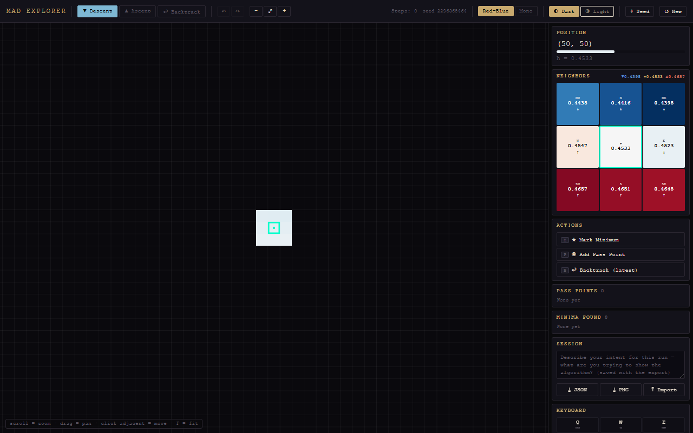
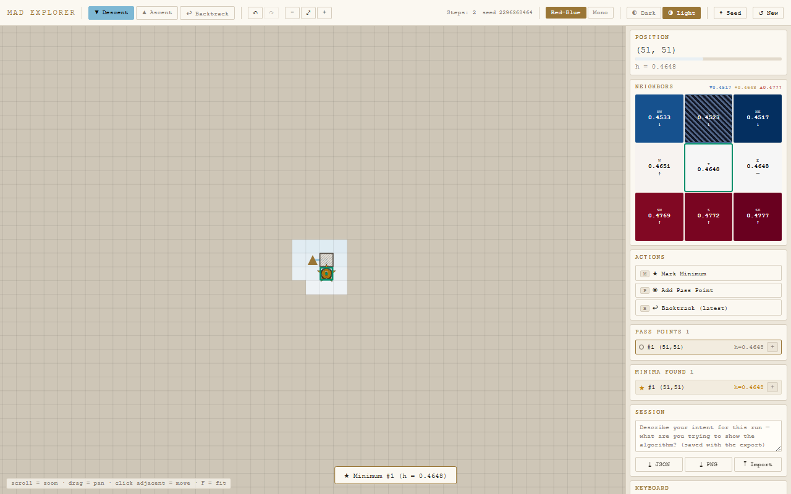

# MAD - Minimum Ascent Descent

<!-- Languages -->
[](https://isocpp.org/)
[](https://www.typescriptlang.org/)
[](https://python.org)

<!-- Tools -->
[](https://vitejs.dev/)
[](https://cmake.org/)

<!-- Project -->
[](CHANGELOG.md)
[](.)

MAD is a global optimization algorithm that treats a loss surface as traversable
terrain and explores it in four phases: **Descent** (steepest descent to a
minimum), **Ascent** (climb out via the shallowest valid uphill direction, avoiding
known minima and recording *pass points* where new branches open), **Backtrack**
(pop the pass-point stack to try other branches), and **Terminate** (stack empty →
return the best minimum found).

This repository holds three things:

| Component | Path | Stack | Purpose |
|-----------|------|-------|---------|
| **Optimizer core** | [`src/`](src/) | C++17 + CMake | The real MAD algorithm; a CLI that runs it on analytic test functions and writes a result JSON. |
| **Trajectory visualizer** | [`visualize.py`](visualize.py) | Python + matplotlib | Renders a result JSON as a contour + phase-colored trajectory PNG. |
| **MAD Explorer** | [`frontend/`](frontend/) | TypeScript + Vite | A human-driven tool to *walk* a 2D landscape by hand and demonstrate the intent of the algorithm to an agent/developer. Deployed to GitHub Pages. |

## MAD Explorer

The Explorer lets a person play the optimizer: descend into a basin, mark a
minimum, climb out the shallowest way, drop a pass point where the valley branches,
and backtrack through the stack - the same four-phase loop, driven by intuition.
A session exports as a structured **intent trace** (JSON) that an agent can read.



The signature readout is the **neighbor grid**: the 8 surrounding tiles colored
*relative to the current tile* (blue = lower, red = higher, white = current), with
4-decimal heights so micro-slopes stay legible. A light theme is included:



### Run it locally

```bash
cd frontend
npm install
npm run dev        # http://localhost:5173
```

Other scripts: `npm run build` (typecheck + production build to `dist/`),
`npm run preview`, `npm test` (Vitest), `npm run typecheck`.

### Deploy

Pushing to `main` triggers [`.github/workflows/pages.yml`](.github/workflows/pages.yml),
which builds `frontend/` and publishes `frontend/dist` to GitHub Pages. The
production base path is `/MAD/` (set in [`frontend/vite.config.ts`](frontend/vite.config.ts));
change it to match the repository name if you rename the repo.

### The intent trace

`⤓ JSON` downloads `mad-trace-seed<N>.json` (`format: "mad-explorer-trace"`,
`version: 2`): a deterministic `landscape` (regenerable from its seed), the
`start`/`finish`, phase-compressed `phaseRuns`, `passPoints`/`minima` with notes,
an ordered `events` narrative, and the `fullPath`. `⤒ Import` restores a trace;
`⤓ PNG` exports an annotated map image. The landscape is reproducible from its seed
(mulberry32 + 24 gaussian bumps), which is also the hook for a future "run the real
algorithm on the same landscape" comparison.

## Optimizer core (C++)

```bash
cmake -S . -B build
cmake --build build --config Release
./build/mad --fn himmelblau          # writes output/himmelblau_result.json
```

Functions: `himmelblau`, `rastrigin`, `ackley`, `beale`, `quadratic`,
`double_well`. Hyperparameters (`--gamma`, `--epsilon`, `--delta`, `--alpha`,
`--tau`, `--tau_excl`, `--lazy`, `--x0/--y0`, …) are overridable on the CLI; see
[`src/main.cpp`](src/main.cpp) and [`src/types.hpp`](src/types.hpp).

## Visualizer (Python)

```bash
python visualize.py output/himmelblau_result.json output/himmelblau_result.png
# or, with no args, plot every output/*_result.json
python visualize.py
```

Requires `numpy` and `matplotlib`.

## Versioning

Current version: **0.1.0.0** (Alpha). See [CHANGELOG.md](CHANGELOG.md).

The project uses an `A.B.C.D` scheme: `A` is the stage (0 = Alpha, 1 = Beta,
R = Release), `B` is major, `C` is minor, `D` is patch (with `.1` reserved for
test-suite releases). The canonical version lives in [VERSION](VERSION); the npm
package in `frontend/` mirrors the numeric mapping (`0.1.0.0` to `0.1.0`).

## Repository layout

```
src/                          C++ MAD optimizer
visualize.py                  matplotlib trajectory visualizer
frontend/                     MAD Explorer v2 (Vite + TypeScript) - self-contained subproject
  src/                        modules (core → render → neighbor → app)
  tests/                      Vitest unit tests (colormap, landscape, history, trace, neighbor)
legacy/frontend-v1/           archived v1 single-file Explorer (reference)
design_handoff_mad_explorer/  the v2 design handoff (spec + prototype)
docs/                         plans + screenshots
.github/workflows/pages.yml   Pages deploy
```

Notes: `build/` and `output/` are gitignored (the latter is regenerable and some
result JSONs exceed GitHub's 100 MB limit). `changes_version.md`, when present, is
gitignored working memory.
